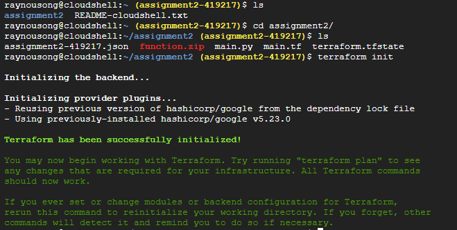
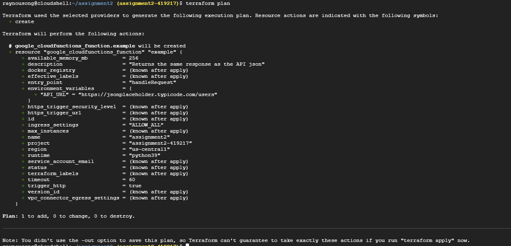
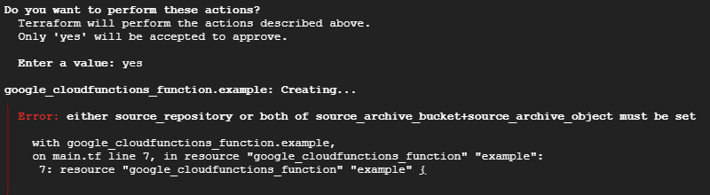

# assessment2

## Description
This is built for using Google Cloud Platform (GCP) which has an in-built terraform in it.

## Setup

1. Clone the following repo:
   ```
   git clone https://github.com/Darkenles/assessment2.git
   cd assessment2
   ```

2. Create a service account in GCP with the necessary permission.
3. Generate a key for the service account in JSON format
4. Save the key in a secure location on your local machine.
5. Edit the main.tf file
   - Replace "path/to/your/service-account-key.json" with the actual path to your service account key JSON file
   - Replace "your-project-id" with the proper project id, so to ensure your terraform knows which GCP project to provision the resources in
6. Initialise, preview, and apply the changes using terraform commands by running the following in bash
   ```
   terraform init
   terraform plan
   terraform apply
   ```
7. The function should be running properly, for checking purposes, you can make an HTTP request to its URL and see if the same response is given as the one in the link provided.

## Error encountered when running terraform apply
1. when running "terraform init"
   
2. when running "terraform plan"
   
3. when running "terraform apply"
   
